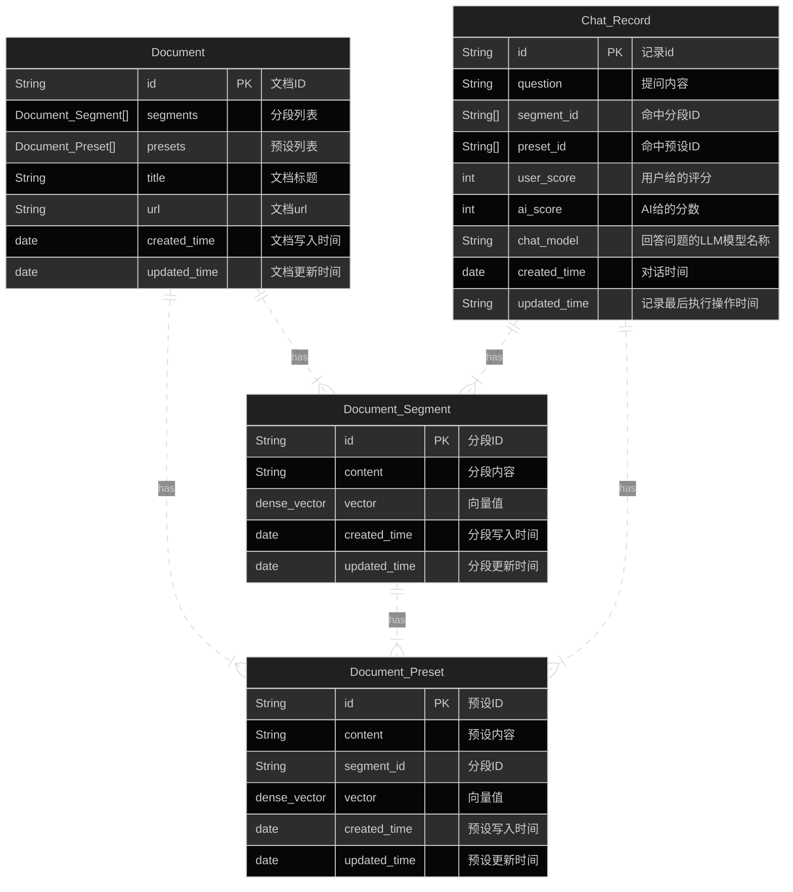

功能列表：
- 更新为es存储
- 反馈机制
- 对话记录

## 界面优化：
- 可以给AI的回答进行打分，好(5)或者不好(0)

d

## 数据存储

有哪些数据？
- 文档元数据 document
- 文档分段 document_segment
- 分段预设问题 document_preset
- 对话记录 chat_record


需要满足哪些功能？
- 检索时，根据preset获取到document
- 对话记录，用户可以给对话打分，记录分数以及问题命中的document和preset




```json

PUT /document
{
  "mappings": {
    "properties": {
      "id": {
        "type": "keyword"
      },
      "segments": {
        "type": "nested",
        "properties": {
          "id": {
            "type": "keyword"
          }
        }
      },
      "presets": {
        "type": "nested",
        "properties": {
          "id": {
            "type": "keyword"
          }
        }
      },
      "title": {
        "type": "text"
      },
      "content": {
        "type": "text"
      },
      "created_time": {
        "type": "date"
      },
      "updated_time": {
        "type": "date"
      }
    }
  }
}

```

```json
PUT /document_segment
{
  "mappings": {
    "properties": {
      "id": {
        "type": "keyword"
      },
      "content": {
        "type": "text"
      },
      "dense_vector": {
        "type": "dense_vector",
        "dims": 768,  // 这里假设我们使用的模型生成了768维的嵌入向量
        "index": true,  // 启用向量索引，使得可以进行近似最近邻搜索
        "similarity": "cosine"  // 使用余弦相似性作为向量相似度量方法
      },
      "created_time": {
        "type": "date"
      },
      "updated_time": {
        "type": "date"
      }
    }
  }
}

```

```json
PUT /document_preset
{
  "mappings": {
    "properties": {
      "id": {
        "type": "keyword"
      },
      "content": {
        "type": "text"
      },
      "dense_vector": {
        "type": "dense_vector",
        "dims": 768,  // 这里假设我们使用的模型生成了768维的嵌入向量
        "index": true,  // 启用向量索引，使得可以进行近似最近邻搜索
        "similarity": "cosine"  // 使用余弦相似性作为向量相似度量方法
      },
      "created_time": {
        "type": "date"
      },
      "updated_time": {
        "type": "date"
      }
    }
  }
}
```

```json
PUT /chat_record
{
  "mappings": {
    "properties": {
      "id": {
        "type": "keyword"
      },
      "question": {
        "type": "text"
      },
      "answer": {
        "type": "text"
      },
	 "segments": {
        "type": "nested",
        "properties": {
          "id": {
            "type": "keyword"
          }
        }
      },
      "presets": {
        "type": "nested",
        "properties": {
          "id": {
            "type": "keyword"
          }
        }
      },
      "user_score": {
        "type": "integer"
      },
      "model_score": {
        "type": "integer"
      },
      "created_time": {
        "type": "date"
      },
      "updated_time": {
        "type": "date"
      }
    }
  }
}
```
