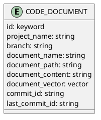

#imile-chat  

参考文献：

- [AI 辅助理解现有代码：自然语言搜索的 RAG 策略设计与 IDE 插件的落地 - Phodal | Phodal - A Growth Engineer](https://www.phodal.com/blog/ai-assistant-understanding-codebase/)
- [GitHub - unit-mesh/auto-dev-vscode: AutoDev - 🧙‍the AI-powered coding wizard . Put the most loved AutoDev AI assistant into your VSCode, and have things done quickly](https://github.com/unit-mesh/auto-dev-vscode)
- [Shire - AI 辅助编程与 AI 编程智能体语言：颠覆传统编程的利器 - Phodal | Phodal - A Growth Engineer](https://www.phodal.com/blog/introduction-shire/)
- [论文: 树形结构的RAG检索](https://www.yuque.com/attachments/yuque/0/2024/pdf/219287/1718734612819-4b3b1f43-8eab-4eca-9230-97b22ed98044.pdf)

## 背景分析

用户可能提问的内容

1. **代码描述和定位：**
    - scanLogContext类有哪些重要字段，并解释其作用
    - {{ 数据表名称 }} 这个表被哪些服务使用到？
1. **代码结构和依赖关系：**
    - 出站扫描功能依赖于哪些其他模块
    - 请描述下复重扫描流程
2. **代码文档和注释：**
    - 能帮我找到关于权限管理管理模块的文档吗？
    - 这段代码逻辑是什么？有相关的注释吗？
3. **版本历史和代码变更：**
	- 总结下 tms-hub  master 最新 commit 的内容
    - 昨天谁修改了入站扫描相关的代码？
4. **错误排查和解决：**
	- {{ 提供一段报错日志 }} 请分析 tmshub 中问题的报错原因，以及如何解决？
    - {{ 提供api接口url }} 这个API报错 {code} 是什么问题？
5. **代码优化和重构建议：**
    - 数据库查询那部分代码怎么优化性能？
    - 有没有更好的方法来重构这段重复的代码？
6. **代码测试和覆盖率：**
    - 请参考il-rdc的单元测试代码规范，给ilts的mailParseService 编写单元测试
    - il-rdc中单元测试对哪些流程进行了测试？


| v2.1 需要实现的                           | 实现要点                                                                                     | checklist    |
| ------------------------------------ | ---------------------------------------------------------------------------------------- | ------------ |
| <font color="#f79646">代码描述和定位</font> | 1. 可以根据{{用户问题}}获取到要找的{{东西名称}}, 最后找到指定的文件。（使用nlp或者llm）<br>2. 根据指定的文件，获取到文件元信息，引用关系，被引用关系。 | 1. 保存文件的元数据。 |
| <font color="#f79646">代码文档和注释</font> | 1. 除了代码文件，还需要md,pom,properties类型的文件。<br>2. 注释内容需要保存在文件中。                                 |              |
| <font color="#f79646">错误排查和解决</font> | 1. 根据错误日志获取到调用链，根据调用链的信息可以找到相关的代码块信息                                                     |              |


### 数据加载
从 gitlab 中可以指定项目名称拉取需要的文件
- 可以设置分支
- 需要的文件类型
- 可以过滤不需要的文件名称

### 数据清洗
java 文件清洗：
- 无用代码清洗：
- 提取代码元数据：类，函数名称 （正则表达式分析）

### 代码分析
![[代码分析流程]]

class meta
- project_name
- commit_id
- last_commit_id
- class_path
- class_name
- class_fields
- class_method


### 数据切割

文档的大小多大比较好？太大会浪费 token，太小会影响逻辑完整性

1. **保持语义完整性**：尽量保证每个切割片段都是语义完整的代码单元（如类、方法）。
2. **保持结构层级**：尽量在代码结构自然的边界（如类定义开始或结束、方法定义开始或结束）进行切割，避免在中间切断。

### 数据补充

- **上下文注释**：在切割点前后添加上下文注释，标明这是切割后的片段，以便后续整理和组合。
- **保持原始位置信息**：记录每个片段的原始文件位置（行号、列号），方便后续追溯和参考。

### 数据存储


```json
PUT /chat_record
{
  "mappings": {
    "properties": {
      "id": {
        "type": "keyword"
      },
      "question": {
        "type": "text"
      },
      "answer": {
        "type": "text"
      },
      "segments": {
        "type": "nested",
        "properties": {
          "id": {
            "type": "keyword"
          }
        }
      },
      "presets": {
        "type": "nested",
        "properties": {
          "id": {
            "type": "keyword"
          }
        }
      },
      "user_score": {
        "type": "integer"
      },
      "model_score": {
        "type": "integer"
      },
      "created_time": {
        "type": "date"
      },
      "updated_time": {
        "type": "date"
      }
    }
  }
}
```

### 数据检索

### 数据返回
- 提供参考代码在 gitlab 的 url


## 总结
全流程
```plantuml
!theme vibrant
entity 调度器 as core
participant 数据加载 as load
database GitLab
participant 文件切割 as split
participant 文本向量器 as embedd
entity LLM

database ElasticSearch as es

==数据存储==

group setp1
	core -> load ++: 获取数据
	load -> GitLab ++: 获取项目代码所有文件
	GitLab --> load --: 文件列表
	load --> load : 过滤不需要的文件
	load --> load : 封装成document类型
	load --> core --: documents
end
group step2
	core -> split ++: documents
	opt java文件
	split -> LLM : 按照json格式，从文件对提取元数据
	split -> split : 按照方法纬度切割
	else 其他文件类型
	split -> split : 不切割
	end
split --> core --: 切割后的documents
end

group step3:
	core -> embedd ++: 向量化
	embedd --> core --:
end

group step4:
	core -> es ++: 数据存储
	es --> core  --:
end
==数据检索==
```

