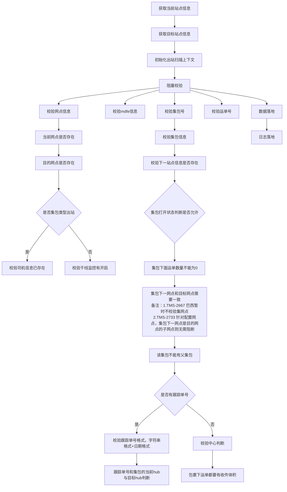

# 复重
![[负重扫描流程]]

# 出站

## 阻断校验

校验网点信息：
1. 当前网点是否存在
2. 目的网点是否存在
3. 如果是集包类型出站：校验司机信息已存在
4. 如果是非集包类型出站：校验干线监控有开启

校验集包信息（ScanNumberType.BAG）
1. 校验下一站点信息是否存在
2. 如果集包打开状态,判断是否允许
3. 集包下面运单数量不能为0
4. 集包下一网点和目标网点需要一致（备注：1.TMS-2667 巴西暂时不校验集网点  2.TMS-2733 针对配置网点，集包下一网点是目的网点的子网点则无需阻断）
5. 该集包不能有父集包
6. 如果有跟踪单号
	1. 校验跟踪单号格式，字符串格式+日期格式
	2. 跟踪单号和集包的当前hub与目标hub判断
7. 校验中心判断
8. 包裹下运单都要有收件体积

运单校验(ScanNumberType.WAYBILL)
1. 如果有跟踪单号
	1. 校验跟踪单号格式，字符串格式+日期格式
	2. 跟踪单号和集包的当前hub与目标hub判断
2. 根据司机编码判断是否需要校验派件网点信息
	1. 司机派件网点需要和运单的目的网点一致
3. 如果当前站点是华南仓
	1. 运单需要有收件重量
	2. 运单需要已绑定批次号

## 数据落地
1. 处理mdfe数据
3. 集包出站处理：
	1. 修改集包号isSent=1
	2. 更新或者保存出站任务信息
	3. 更新归班记录
	4. 保存集包扫描数据
	5. 更新集包待出站数量
	6. 处理TMS干线信息
	7. 处理笼车信息
4. 运单出站处理：
	1. 处理发件任务
		1. 如果存在发件任务，且目的和出站目的地相同，不进行后续处理。
		2. 如果存在发件任务，且目的地和出站目的地不同，标记发件任务的isLast=false，表示非最新。
		3. 初始化发件任务dto，保存到上下文中。
	2. 处理任务单
		1. 如果存在任务单，则更新任务单状态为COMPLETE并保存
		2. 如果不存在任务单，创建新任务单对象并保存
	3. 针对MAS出站判断集包状态
5. 发送mq消息给TMS

单测点：

优化点：