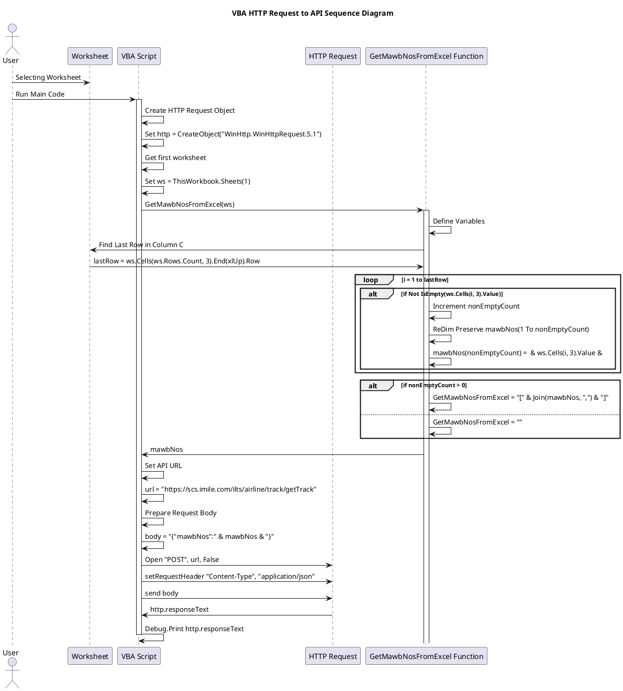

```plantuml
@startuml  
title VBA HTTP Request to API Sequence Diagram  
  
actor User  
  
participant "Worksheet" as ws  
participant "VBA Script" as vba  
participant "HTTP Request" as http  
participant "GetMawbNosFromExcel Function" as func  
  
User -> ws : Selecting Worksheet  
User -> vba : Run Main Code  
  
activate vba  
vba -> vba : Create HTTP Request Object  
vba -> vba : Set http = CreateObject("WinHttp.WinHttpRequest.5.1")  
vba -> vba : Get first worksheet  
vba -> vba : Set ws = ThisWorkbook.Sheets(1)  
  
vba -> func : GetMawbNosFromExcel(ws)  
activate func  
func -> func : Define Variables  
func -> ws : Find Last Row in Column C  
func <- ws : lastRow = ws.Cells(ws.Rows.Count, 3).End(xlUp).Row  
  
loop i = 1 to lastRow  
    alt if Not IsEmpty(ws.Cells(i, 3).Value)  
        func -> func : Increment nonEmptyCount  
        func -> func : ReDim Preserve mawbNos(1 To nonEmptyCount)  
        func -> func : mawbNos(nonEmptyCount) = """" & ws.Cells(i, 3).Value & """"  
    end  
end  
  
alt if nonEmptyCount > 0  
    func -> func : GetMawbNosFromExcel = "[" & Join(mawbNos, ",") & "]"  
else  
    func -> func : GetMawbNosFromExcel = ""  
end  
  
vba <- func : mawbNos  
  
vba -> vba : Set API URL  
vba -> vba : url = "https://scs.imile.com/ilts/airline/track/getTrack"  
vba -> vba : Prepare Request Body  
vba -> vba : body = "{"mawbNos":" & mawbNos & "}"  
  
vba -> http : Open "POST", url, False  
vba -> http : setRequestHeader "Content-Type", "application/json"  
vba -> http : send body  
  
http -> vba : http.responseText  
vba -> vba : Debug.Print http.responseText  
deactivate vba  
  
@enduml
```